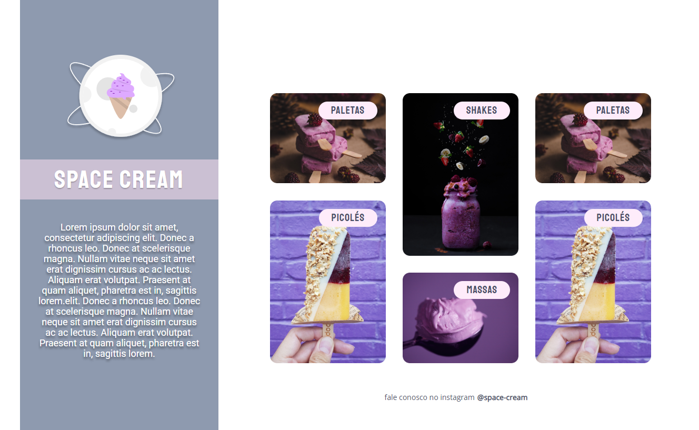

<h1 align="center"> Space Cream </h1>

  <a href="#-tecnologias">Tecnologias</a>&nbsp;&nbsp;&nbsp;|&nbsp;&nbsp;&nbsp;
  <a href="#-projeto">Projeto</a>&nbsp;&nbsp;&nbsp;|&nbsp;&nbsp;&nbsp;
  <a href="#-layout">Layout</a>&nbsp;&nbsp;&nbsp;|&nbsp;&nbsp;&nbsp;

 

  

## 🚀 Tecnologias

Esse projeto foi desenvolvido com as seguintes tecnologias:

- HTML
- CSS
- Git e Github

## 💻 Projeto

O Space Cream é um projeto do curso Explorer Rocketseat, para aplicação dos seguintes conceitos:

- Mobile First.
- Unidade de medida flexível.
- Variáveis no css.
- Animações simples.
