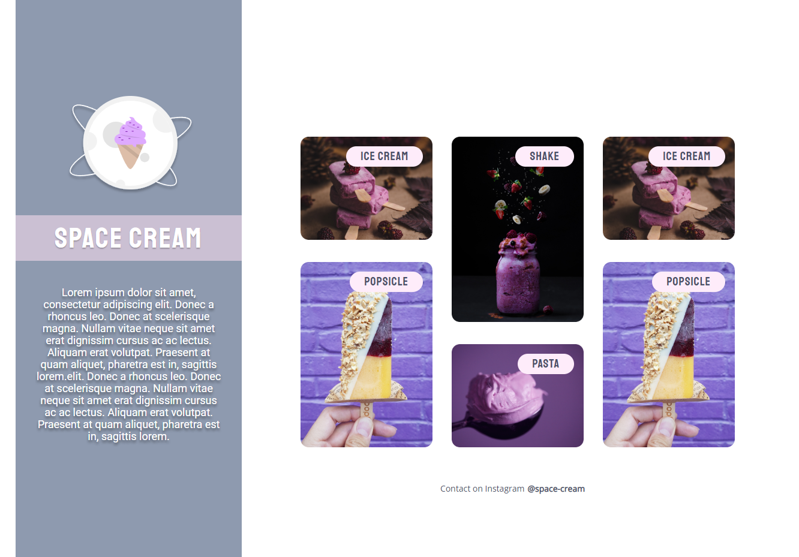

<h1 align="center"> Space Cream </h1>

  <a href="#-tecnologias">Technologies</a>&nbsp;&nbsp;&nbsp;|&nbsp;&nbsp;&nbsp;
  <a href="#-projeto">Project</a>&nbsp;&nbsp;&nbsp;|&nbsp;&nbsp;&nbsp;

 

  

## 🚀 Tecnologias

This project has been developed with the following technologies:

- HTML
- CSS
- Git e Github

## 💻 Project

The Space Cream is a project of Explorer course from Rocketseat, to apply the following concepts:

- Mobile First.
- Desktop Version.
- Media queries.
- Flexible measurement unit.
- Variables on css.
- Animation and transitions.
